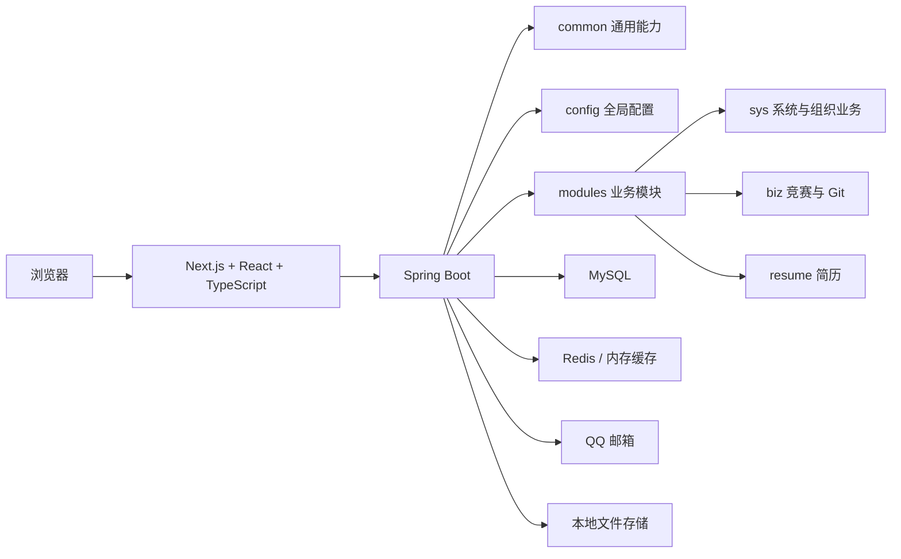

# CSA 项目全景图

## 结构视图



## 模块视图与请求链路不能混为一谈

模块视图回答“代码按什么业务组织”：

```text
modules
├─ sys
├─ biz
└─ resume
```

请求链路回答“一次请求依次经过什么组件”：

```text
页面
-> 业务组件
-> 前端 service
-> Axios
-> Spring Security
-> Controller
-> Service（如果该接口有）
-> Mapper
-> MySQL / 缓存 / 文件
-> 统一返回
-> 前端渲染
```

这两张图必须分开理解。`sys/biz/resume` 是模块边界，不是请求在运行时依次经过的三个步骤。
